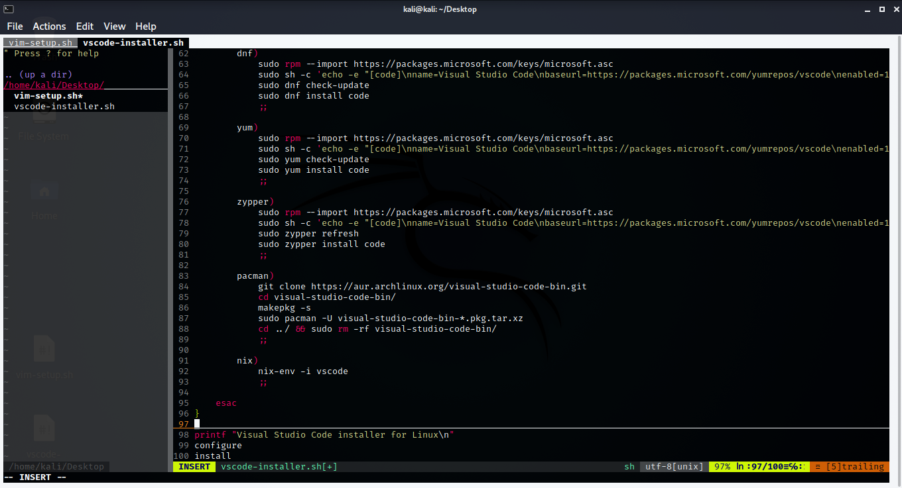
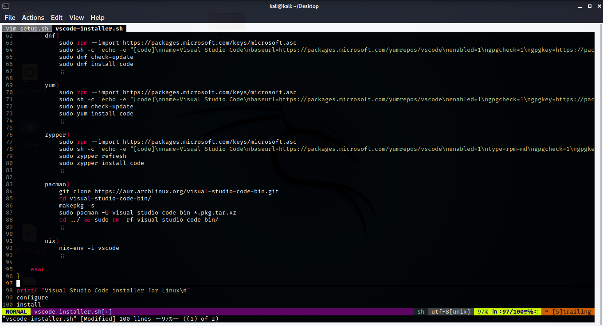

<br>

</p>

# About
My simple vim setup. To install it, you have to run [vim-setup.sh](https://github.com/1RaY-1/vim-setup/blob/main/vim-setup.sh)

# Setup

If you run [vim-setup.sh](https://github.com/1RaY-1/vim-setup/blob/main/vim-setup.sh), it will do this things:

* Create ```~/.vim/pack/vendor/start/``` and ```~/.vim/colors/``` directories, to move there color scheme and plugins.
* Install [monokai](https://github.com/sickill/vim-monokai) colorscheme.
* Install some other plugins: [nerdtree](https://github.com/preservim/nerdtree), [vim-buftabline](https://github.com/ap/vim-buftabline), [AutoComplPop](https://github.com/vim-scripts/AutoComplPop), [vim-airline](https://github.com/vim-airline/vim-airline).
* Move simple [vim config file](https://github.com/1RaY-1/vim-setup/blob/main/.vimrc) (.vimrc file) to home directory (to use it as a vim config). 

# Screenshots
<br>
<p align="center">


</p>

# How to install this setup

Before installing this setup, make sure that you have **vim** and **git**.

Then just type in your terminal this:

```
git clone https://github.com/1RaY-1/vim-setup
sh vim-setup/vim-setup.sh
```
